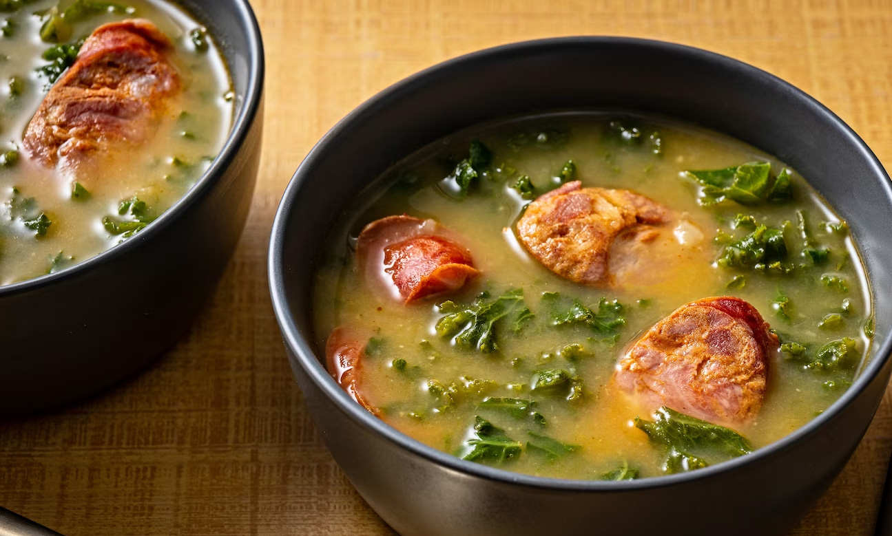

# [Livro de Receitas](../README.MD)

## Caldo Verde

### Ingredientes:

- 500g de batatas descascadas e cortadas em cubos
- 1 cebola grande picada
- 2 dentes de alho picados
- 200g de couve-galega cortada em tiras finas
- 100g de chouriço cortado em rodelas finas
- Azeite
- Sal

## Modo de preparo:

- Cozinhe as batatas em água com sal até ficarem macias. Reserve.
- Em outra panela, refogue a cebola e o alho no azeite até dourarem.
- Adicione as batatas cozidas à panela e amasse-as grosseiramente.
- Acrescente água suficiente para obter a consistência desejada.
- Adicione a couve-galega e cozinhe por alguns minutos até amolecer.
- Corrija o sal, se necessário. Sirva quente, com as rodelas de chouriço por cima.

## Resultado:

