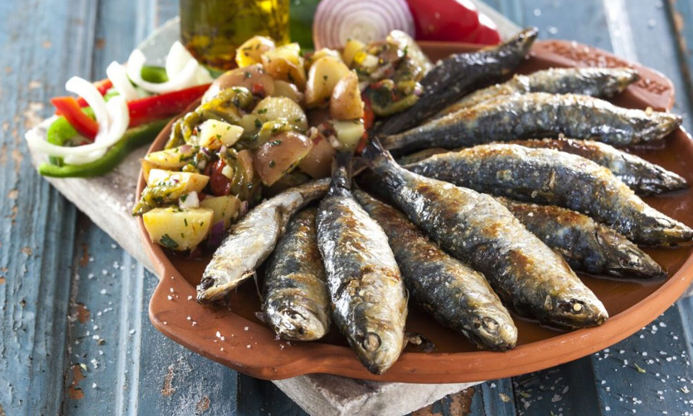

# [Livro de Receitas](../README.md)

## Sardinhas Assadas

### Ingredientes:

- Sardinhas frescas e limpas
- Sal grosso
- Azeite
- Limão

## Modo de preparo:

- Lave bem as sardinhas e faça alguns cortes diagonais em cada uma.
- Tempere com sal grosso e deixe descansar por cerca de 30 minutos.
- Pré-aqueça o forno a 200°C.
- Coloque as sardinhas em uma assadeira untada com azeite.
- Leve ao forno por cerca de 20 minutos ou até que estejam douradas e cozidas.
- Sirva regadas com um fio de azeite e acompanhadas de rodelas de limão.

## Resultado:

